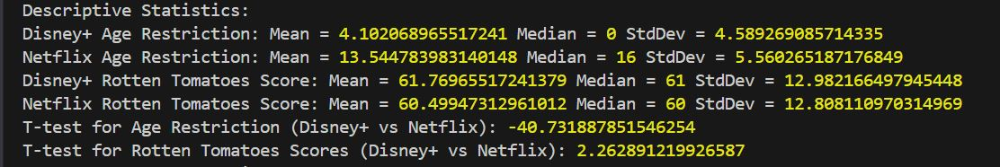

## Descriptive Statistics

### Age Restriction

- **Disney+**:

  - Mean: 4.10
  - Median: 0
  - StdDev: 4.59

- **Netflix**:
  - Mean: 13.54
  - Median: 16
  - StdDev: 5.56

### Rotten Tomatoes Score

- **Disney+**:

  - Mean: 61.77
  - Median: 61
  - StdDev: 12.98

- **Netflix**:
  - Mean: 60.50
  - Median: 60
  - StdDev: 12.81

### T-test for Age Restriction (Disney+ vs Netflix):

- T-test result: **-40.73**
